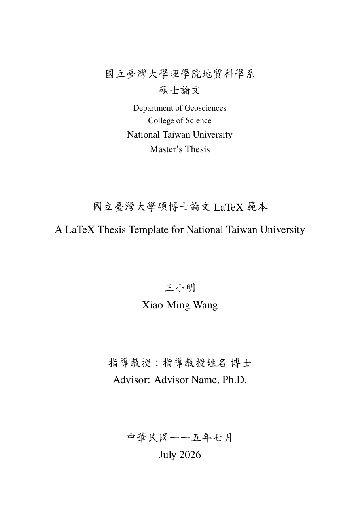

# 國立臺灣大學碩博士論文 LaTeX 範本<br>NTU Thesis / Dissertation LaTeX Template

[](https://www.overleaf.com/docs?snip_uri=https://github.com/FormosaRes/ntu-thesis-latex/archive/refs/heads/main.zip)
[](LICENSE)
[](#-環境需求-requirements)
[](ntuthesis.cls)
[](docs/format-spec.md)
[](docs/bookspine.md)
[](docs/graduation-checklist.md)
[](https://github.com/FormosaRes/ntu-thesis-latex/actions/workflows/build.yml)

一份**非官方、開放使用**的 XeLaTeX 範本，適用於**國立臺灣大學**所有系所的碩士論文與
博士論文。版面依據校方**現行**規範
《國立臺灣大學碩、博士學位論文格式規範》（**112.10.20 / 2023** 教務會議通過）實作。
給臺大碩博生一個開箱即用、看得懂、改得動的起點。

## 🔎 你可能是為了這兩件事來的

<table>
<tr>
<td width="50%" valign="top">

### 📐 學校要的格式長怎樣？

<a href="docs/format-spec.md"></a>

**[👉 格式規範速查（一頁看完）](docs/format-spec.md)**
<sub>［[English](docs/format-spec-en.md)］</sub>

封面版面與字級、論文次序、邊界行距、印製裝訂、
要繳幾冊 —— **不用會 LaTeX、不用下載**，
直接在網頁上看完。

</td>
<td width="50%" valign="top">

### 📏 書背怎麼做？

<a href="docs/bookspine.md"></a>

**[👉 書背製作完整說明](docs/bookspine.md)**
<sub>［[English](docs/bookspine-en.md)］</sub>

上面要放什麼、**寬度怎麼抓**（最多人卡住的地方）、
Word／LaTeX／交給廠商三種做法、送印前檢查清單。

📥 直接下載 [Word 版書背](word/ntu-bookspine.docx)

</td>
</tr>
</table>

---

📄 **想看完整成品？** [`example.pdf`](example.pdf)（15 頁內文版面）與
[`example-bookspine.pdf`](example-bookspine.pdf)（書背），即為本範本編譯結果。

📄 **只想要封面／書背，不想碰 LaTeX？** → [**Word 版範本**](word/)（下載填空即可）

☁️ **沒裝過 LaTeX？不用裝。** 點下面按鈕直接在瀏覽器開始寫 →
[](https://www.overleaf.com/docs?snip_uri=https://github.com/FormosaRes/ntu-thesis-latex/archive/refs/heads/main.zip)
（開啟後**務必**把編譯器改成 XeLaTeX，見 [Overleaf 使用說明](docs/overleaf.md)）

> ⚠️ **非官方範本 (unofficial).** 定稿前請對照官方文件：
> [**《格式規範》THESISSAMPLE.doc**](https://www.lib.ntu.edu.tw/doc/cl/THESISSAMPLE.doc)（規範全文，含封面等附件範例）
> 與 [臺大圖書館 — 論文繳交及離校手續](https://www.lib.ntu.edu.tw/node/103)，
> 並與指導教授及系所確認。各系所得依規範 §13 另訂細節。

🎓 **論文排好版之後呢？** → [**臺大碩博士離校手續完整流程**](docs/graduation-checklist.md)
（[English](docs/graduation-checklist-en.md)）
從申請學位考試、口試、電子論文上傳、紙本冊數、授權書，到領學位證書，一頁走完。

---

## ✨ 特色 Features

- ✅ **符合校方現行格式規範**（邊界、字體、行距、頁碼、論文次序）
- ✅ **一個地方設定所有論文資訊** — `main.tex` 的 `\ntusetup{...}` 區塊
- ✅ **自動產生**封面／書名頁（附件1）、**書背／側邊**（§2）、口試委員會審定書（附件3）
- ✅ **中英文雙語摘要環境**，含 5–7 個關鍵詞
- ✅ **書背可單獨編譯**（`bookspine.tex` → `bookspine.pdf`），長題目自動縮放不裁切
- ✅ **適用任何系所** — 學院／系所／碩博士皆為參數
- ✅ **字型自動 fallback**，在本機與 Overleaf 皆可編譯
- ✅ 內附**示範內文**（圖、表、公式、引用、交叉參照）教你怎麼用

## 📁 檔案結構 File structure

```
ntu-thesis-latex/
├── main.tex              # ★ 從這裡開始：含 \ntusetup{...} 論文資訊區塊
├── ntuthesis.cls         # 格式規範實作（使用者不需修改）
├── bookspine.tex         # 書背單獨編譯 → bookspine.pdf
├── front/                # 前置部分
│   ├── acknowledgements.tex  # 謝辭 (§4)
│   ├── abstract-zh.tex       # 中文摘要 (§5)
│   ├── abstract-en.tex       # 英文摘要 (§6)
│   └── denotation.tex        # 符號說明（可選）
├── chapters/             # 內文各章（示範圖／表／公式／引用）
│   ├── chapter1-introduction.tex
│   ├── chapter2-method.tex
│   └── chapter3-conclusion.tex
├── back/
│   ├── appendix.tex          # 附錄
│   └── references.bib        # 參考文獻資料庫
├── figures/              # 放圖檔
├── word/                 # 📄 Word 版封面與書背（不用 LaTeX 也能用）
│   ├── ntu-cover.docx
│   └── ntu-bookspine.docx
├── docs/
│   ├── format-spec.md / -en.md      # 📐 格式規範速查（學校要什麼，一頁看完）
│   ├── bookspine.md / -en.md        # 📏 書背製作完整說明（含寬度怎麼抓）
│   ├── overleaf.md                  # ☁️ 零安裝：在 Overleaf 上寫論文
│   ├── graduation-checklist.md      # 🎓 離校手續完整流程（申請口試→領證書）
│   └── graduation-checklist-en.md   # 🎓 同上，英文版（給國際生）
├── .github/workflows/build.yml  # CI：自動編譯並產出 PDF
└── LICENSE               # MIT
```

## 🔧 環境需求 Requirements

**兩條路,挑一條就好:**

| | ☁️ 路線 A：Overleaf（推薦新手） | 🖥️ 路線 B：本機編譯 |
|---|---|---|
| 要安裝什麼 | **什麼都不用裝**,瀏覽器即可 | TeX Live 2022+ / MiKTeX |
| 適合 | 沒碰過 LaTeX、不想搞環境 | 長論文、想編譯快一點 |
| 編譯引擎 | 手動選 **XeLaTeX**（預設是 pdfLaTeX,**一定要改**）| **XeLaTeX（必須）** |
| 中文字型 | 伺服器內建 `AR PL UKai TW`,**開箱即可編出楷體** | 建議裝標楷體;缺字時自動 fallback |
| 說明 | 👉 [**docs/overleaf.md**](docs/overleaf.md) | 見下方快速開始 |

> 需要的 LaTeX 套件：`xeCJK`, `fontspec`, `adjustbox`（Overleaf 與完整版 TeX Live 都已內含）。

## 🚀 快速開始 Quick start

### ☁️ 路線 A：Overleaf（零安裝）

[](https://www.overleaf.com/docs?snip_uri=https://github.com/FormosaRes/ntu-thesis-latex/archive/refs/heads/main.zip)

1. 點上面按鈕 → Overleaf 自動建立你的專案
2. ⚠️ `Menu ▸ Settings ▸ Compiler` 改成 **XeLaTeX**、`Main document` 設為 `main.tex`
3. 按 Recompile,開始寫

完整圖解、字型上傳、疑難排解 → [**docs/overleaf.md**](docs/overleaf.md)

### 🖥️ 路線 B：本機編譯

1. 下載或 `git clone` 本範本。
2. 打開 **`main.tex`**，只改 `\ntusetup{...}` 區塊（系所、題目、姓名、指導教授、
   關鍵詞、日期）。碩士改博士：把 `degree = master` 改成 `degree = doctor`
   （或 `\documentclass[doctor]{ntuthesis}`）。
3. 編譯：

   ```bash
   latexmk -xelatex main.tex        # 產出 main.pdf
   xelatex bookspine.tex            # 產出 bookspine.pdf（書背）
   ```

  Overleaf 內建 fandol／TeX Gyre Termes，字型 fallback 會自動生效。
- **VS Code**：安裝 LaTeX Workshop，設定使用 `latexmk (xelatex)` recipe。

## ⚙️ 論文資訊設定 Configuration（`\ntusetup`）

| 參數 | 說明 | 範例 |
|---|---|---|
| `degree` | `master` 或 `doctor` | `master` |
| `collegeCH` / `collegeEN` | 學院中英文 | `理學院` / `College of Science` |
| `deptCH` / `deptEN` | 系所中英文 | `地質科學系` / `Department of Geosciences` |
| `titleCH` / `titleEN` | 論文題目中英文 | — |
| `authorCH` / `authorEN` | 撰者中英文姓名 | — |
| `studentID` | 學號 | `R12XXX001` |
| `advisorCH` / `advisorEN` | 指導教授 | — |
| `advisortitleCH` / `advisortitleEN` | 學位／職銜 | `博士` / `Ph.D.` |
| `coadvisorCH` / `coadvisorEN` | 共同指導教授（可省略） | — |
| `dateCH` / `dateEN` | 封面日期 | `中華民國一一五年七月` / `July 2026` |
| `examdateCH` / `examdateEN` | 口試日期（審定書用） | — |
| `keywordsCH` / `keywordsEN` | 關鍵詞（**各 5–7 個**，逗號分隔） | — |

> 值含逗號時請用大括號包住，例如 `keywordsCH = {甲, 乙, 丙}`。

## 📖 書背製作 Book spine

`bookspine.tex` 會單獨產生書背 PDF；請保持其中的 `\ntusetup` 與 `main.tex` 一致。
書背內容依規範 §2：校名、系所、學位、論文中文題目、撰者姓名、提出年月，直式排列、
長題目自動縮放。若你的裝訂厚度不同，可調整書背長度：

```latex
\setlength{\spineheight}{25cm}   % 於 bookspine.tex 的 preamble
```

也可以不單獨編譯，直接讓書背出現在 `main.pdf`（`main.tex` 已呼叫 `\makespine`）。

## 🔤 字型說明 Fonts

規範要求中文楷書、英文 Times New Roman。範本會自動偵測並 fallback：

- 英文：`Times New Roman` → `TeX Gyre Termes`
- 中文：`BiauKai`(標楷體) → `TW-Kai` → `AR PL UKai TW` → `FandolKai` → `WenQuanYi Zen Hei`

正式繳交建議在本機安裝**標楷體**與 **Times New Roman** 以完全符合規範外觀。

## 📐 規範對照 Regulation mapping

| 規範 | 內容 | 實作 |
|---|---|---|
| 論文次序 | 封面→書名頁→審定書→謝辭→中摘→英摘→目次→圖次→表次→正文→參考文獻→附錄 | `main.tex` |
| §10 邊界 | 上 3／下 2／左右各 3 cm | `geometry` |
| §10 字體 | 中文 12pt 楷書、英文 12pt Times New Roman | 自動偵測 + fallback |
| §10 行距 | 中文 1.5 倍行距 | `\linespread{1.5}`（英文論文可改 `\doublespacing`）|
| §10 頁碼 | 各頁正下方置中 | 前置羅馬、正文阿拉伯 |
| 附件1 | 封面各行置中、指定級數 | `\maketitlepage` |
| §2 | 書背／側邊 | `\makespine` / `bookspine.tex` |
| 附件3 | 口試委員會審定書 | `\makecertificate` |
| §5/§6 | 中英文摘要各 5–7 關鍵詞 | `abstractCH` / `abstractEN` |
| §14 | 繳交冊數：圖書館 2 冊；**數學、物理、化學、海洋、社會科學院、法律學院各系所 3 冊** | 見規範 |

## ❓ 常見問題 FAQ

- **編譯出現一堆亂碼／缺字？** 請確認用的是 **XeLaTeX**，不是 pdfLaTeX。
  Overleaf 預設是 pdfLaTeX，**一定要手動改** → [說明](docs/overleaf.md)。
- **中文變成別的字體？** 沒有標楷體，套用了 fallback（正常，仍是楷書）。
  要精準標楷體：把 `kaiu.ttf` 放進專案，解除 `main.tex` 裡 `\setCJKmainfont` 那行的註解。
- **書背題目太長被切掉？** 已用 `adjustbox` 自動縮放；仍要更長可調大 `\spineheight`。
- **審定書要簽名？** 正式版須列印後由口試委員與指導教授親簽，通常以掃描頁替換此頁。

## 📜 授權 License

MIT（見 `LICENSE`）。範本可自由使用與修改。校方規範文字著作權屬國立臺灣大學。

## 🙏 參考 References & credits

- [國立臺灣大學碩、博士學位論文格式規範（PDF, 112.10.20）](https://www.csie.ntu.edu.tw/xhr/announcements/file/654311fd08911a8cae743f14/%E5%9C%8B%E7%AB%8B%E8%87%BA%E7%81%A3%E5%A4%A7%E5%AD%B8%E7%A2%A9%E5%8D%9A%E5%A3%AB%E5%AD%B8%E4%BD%8D%E8%AB%96%E6%96%87%E6%A0%BC%E5%BC%8F%E8%A6%8F%E7%AF%841020.pdf)
- [臺大圖書館 — 論文繳交及離校手續](https://www.lib.ntu.edu.tw/node/103)
- 架構參考：[chungyuandye/NTOU_Thesis](https://github.com/chungyuandye/NTOU_Thesis)、
  [Hsins/NTU-Thesis-LaTeX-Template](https://github.com/Hsins/NTU-Thesis-LaTeX-Template)

---

歡迎 issue／PR 一起把臺大論文範本做得更好。Pull requests welcome!
